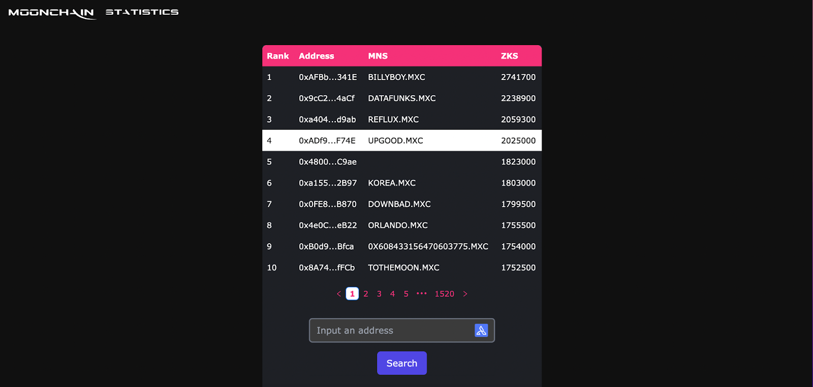
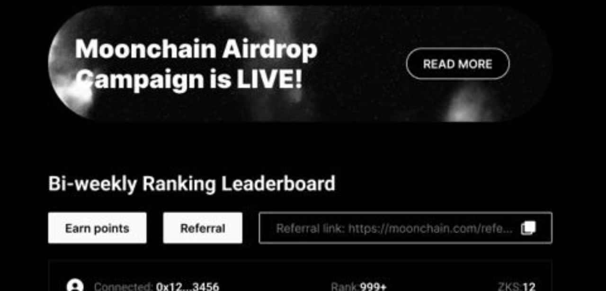
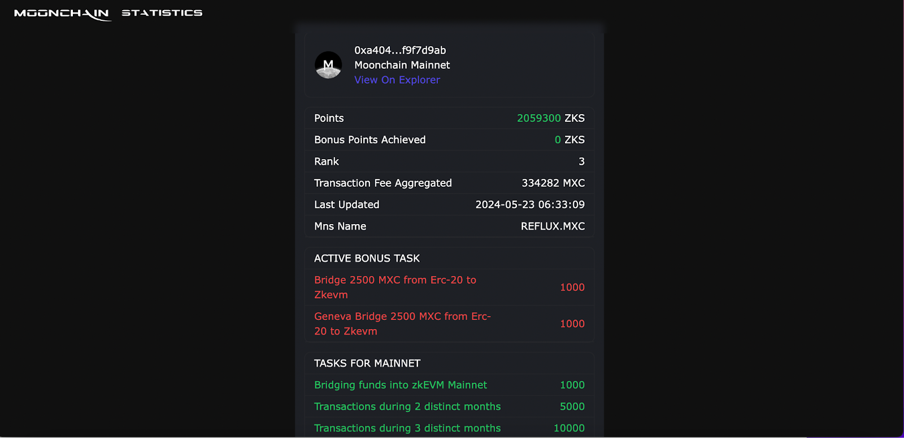

# Incentivized Airdrop Tasks

# Moonchain Loyalty Points Boosting Campaign: Detailed Guide

We are thrilled to announce the upcoming Moonchain Loyalty Points Boosting Campaign. This initiative is designed to reward our loyal users through airdrops and implement a tiered management system to boost user engagement. Here are the details of the event and how you can benefit from it.

## Phase 1: Bi-weekly Airdrops and Rewards Distribution

### Dates:
- **Phase 1**: Will be released soon, with retroactive actions
- **Phase 2**: Will be released soon.

### Initial Airdrop

#### Overview:
During the campaign, the top 30% of the participating users will be eligible to receive 50% of the total prize pool. After the first bi-weekly contest, 50% of the 625,000 MXC prize pool will be distributed to the top 30% of the users, followed by the remaining 50% distributed to the top 30% of the users in the next bi-weekly cycle.

#### Leaderboard:
A bi-weekly leaderboard will be available on our website, allowing users to track their ranking daily. The points system on the official website will be used for calculations.

### Acceleration Plan

#### Official Website Announcement and Bi-weekly Leaderboard:

#### Event Integration:
Additionally, a prize pool of 2000 USDT has been created for Quest campaigns to reward our community for their active participation.

- [Quest Link 1](#) [to be updated]
- [Quest Link 2](#) [to be updated]

#### Evaluation and Iteration:
We will assess the initial phase's effectiveness and refine the distribution process for the second phase based on user feedback and participation levels.

## Reward Structure

### Phase 1 Airdrop Details:
A total of 625,000 $MXC will be distributed over the first month, split into two bi-weekly distributions.

### Contribution Evaluation Criteria:
User contributions will be evaluated based on the following dimensions:
1. **Inviting New Users**: The number of new users invited and the Moonchain points balance obtained through invitations.
2. **On-chain Activity**: Interactions with on-chain contracts, accumulating Moonchain points through completing on-chain tasks such as cross-chain bridges, staking, and minting activities.
3. **User Quality**: Wallet balance or authorized Web3 wallet token balance in cooperation with Moonchain.

### Task Platforms
**SoQuest**: [SoQuest](https://soquest.xyz/space/Moonchain)  
There will be various events set up to allow the community to earn points by referring others and bringing further attention to the Moonchain airdrop.  
Participation conditions: Social media interactions and visiting the Moonchain official airdrop event page.

**QuestN**: [QuestN](https://app.questn.com/moonchain)  
Similar event setup and banner support.  
Participation conditions: Social media interactions and visiting the Moonchain official airdrop event page.

### Monthly Reward Distribution Plan

#### Reward Pool Allocation:
- **Total reward pool**: 625,000 $MXC
- **Bi-weekly reward pool**: 312,500 $MXC

#### Distribution Details:
- **Top 5% of users**: 40% of the bi-weekly reward pool
- **Top 5%-10% of users**: 20% of the bi-weekly reward pool
- **Top 10%-30% of users**: 40% of the bi-weekly reward pool

#### Detailed Allocation:
- **Top 5% of users (Top 50 users)**:
  - Total reward: 125,000 $MXC
  - Average reward per person: 2500 $MXC
- **Top 5%-10% of users (51st-100th users)**:
  - Total reward: 62,500 $MXC
  - Average reward per person: 1250 $MXC
- **Top 10%-30% of users (101st-300th users)**:
  - Total reward: 125,000 $MXC
  - Average reward per person: 625 $MXC

## User Guide:
1. Participate in the Moonchain Loyalty Points Accelerator program through Quest Link for a chance to win an additional 2000 USDT reward.
   - [Quest Link 1](#) [to be updated]
   - [Quest Link 2](#) [to be updated]

2. Visit the official event page.
   - [Official Event Page Link](https://www.moonchain.com/) 

3. Follow the platform's guidance to engage in on-chain interactions:
   
   3.1 Check your total on-chain interaction leaderboard at Moonchain Airdrop Leaderboard.
   
   3.2 Click on your wallet address (or enter it in the search box) to view the details.
   
   3.3 Enter the bi-weekly ranking plan to connect your wallet. Once the wallet is successfully connected, simply click "Copy Link" to send your referral link.

* The invitee needs to complete at least one on-chain task for the invitation to be considered successful.

   

### Referral Tasks
| Tasks                  | Points |
|------------------------|--------|
| Invite a friend        | 500    |
| Invite 3 friends       | 2000   |
| Invite more than 5 friends | 3500 |

3.4 Use the connected wallet to interact with on-chain tasks. Red indicates active bonus tasks, and green represents tasks on the mainnet and points details.

   

### On-chain Tasks
| Tasks                                          | Points  |
|------------------------------------------------|---------|
| Bridging funds into zkEVM Mainnet              | 1000    |
| Transactions during 2 distinct months          | 5000    |
| Transactions during 3 distinct months          | 10000   |
| Transactions during 4 distinct months          | 15000   |
| More than 5 transactions                       | 500     |
| More than 15 transactions                      | 1500    |
| More than 30 transactions                      | 3000    |
| More than 100 transactions                     | 10000   |
| More than 2 dApp interactions                  | 2000    |
| More than 3 dApp interactions                  | 4000    |
| Acquiring 1 MNS                                | 5000    |
| Acquiring more than 3 MNS                      | 15000   |
| 4 letters or less MNS                          | 10000   |
| Transactions exceeding 50,000 MXC in aggregate value | 3500 |
| Transactions exceeding 250,000 MXC in aggregate value | 21700 |
| Transactions exceeding 500,000 MXC in aggregate value | 52000 |
| Transactions exceeding 1,000,000 MXC in aggregate value | 132000 |
| Bridging more than 500,000 MXC of assets       | 3000    |
| Bridging more than 1,000,000 MXC of assets     | 7000    |
| Bridging more than 2,500,000 MXC of assets     | 18000   |
| Bridging more than 5,000,000 MXC of assets     | 40000   |
| Bridging more than 10,000,000 MXC of assets    | 90000   |
| Traded Volume on MXC Swap exceeds 500,000 MXC of value | 5000 |
| Traded Volume on MXC NFT Marketplace exceeds 500,000 MXC of value | 4000 |
| Traded Volume on MXC Swap exceeds 2,500,000 MXC of value | 27500 |
| Traded Volume on MXC Swap exceeds 5,000,000 MXC of value | 60000 |
| Traded Volume on MXC Swap exceeds 10,000,000 MXC of value | 130000 |
| Traded Volume on MXC Swap exceeds 25,000,000 MXC of value | 350000 |
| Traded Volume on MXC NFT Marketplace exceeds 10,000,000 MXC of value | 104000 |
| Providing more than 100,000 MXC of liquidity on either MXC/XSD or xMXC/MXC | 10000 |
| Providing more than 500,000 MXC of liquidity on either MXC/XSD or xMXC/MXC | 50000 |
| Providing more than 1,000,000 MXC of liquidity on either MXC/XSD or xMXC/MXC | 100000 |
| Providing more than 2,000,000 MXC of liquidity on either MXC/XSD or xMXC/MXC | 200000 |
| Providing more than 5,000,000 MXC of liquidity on either MXC/XSD or xMXC/MXC | 500000 |
| Possess MOON token in wallet (applicable with 5+ points) | 1000 |
| Own 1 NEO registered on AXS | 10000 |
| Own 2 NEOs registered on AXS | 20000 |
| Own more than 3 NEOs registered on AXS | 50000 |
| Own more than 2 M2 Pros registered on AXS | 100000 |
| Bridge 2500 MXC from Erc-20 to Zkevm | 1000 |

4. After completing the corresponding tasks, users can check their points and ranking at [https://airdrop.moonchain.com/](https://airdrop.moonchain.com/). Points are refreshed daily, with snapshots taken at 00:00 UTC each day.

## FAQ:

**Q: How can I transfer tokens from other chains to Moonchain?**  
A: You have two ways to transfer MXC assets to Moonchain:
1. Through the official cross-chain bridge: [https://erc20.moonchain.com/](https://erc20.moonchain.com/)
2. Directly withdrawing from OKX or Kucoin exchanges to Moonchain (Native L3 chain)

**Q: What is the total prize pool for the event, and how long does it last?**  
A: The event lasts for one month, with rewards settled every two weeks. The total prize pool is 625,000 MXC and 2,000 USDT. Users can join the event through Soquest and QuestN platforms for a chance to win 2,000 USDT. The 625,000 MXC will be distributed based on the user points ranking.

**Q: How can I check my own rank?**  
A: Your rank is displayed above the leaderboard when you are logged in.

**Q: How often is the leaderboard updated?**  
A: The leaderboard is updated in near real-time as points are earned by community members.
