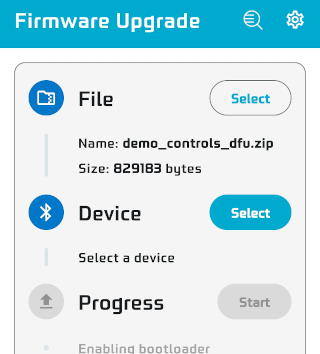
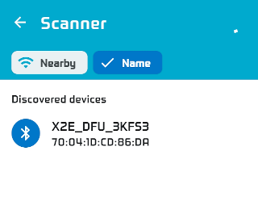
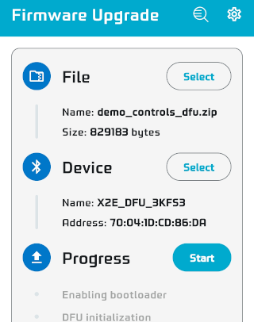
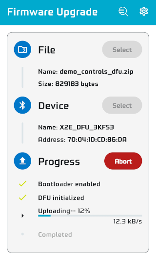
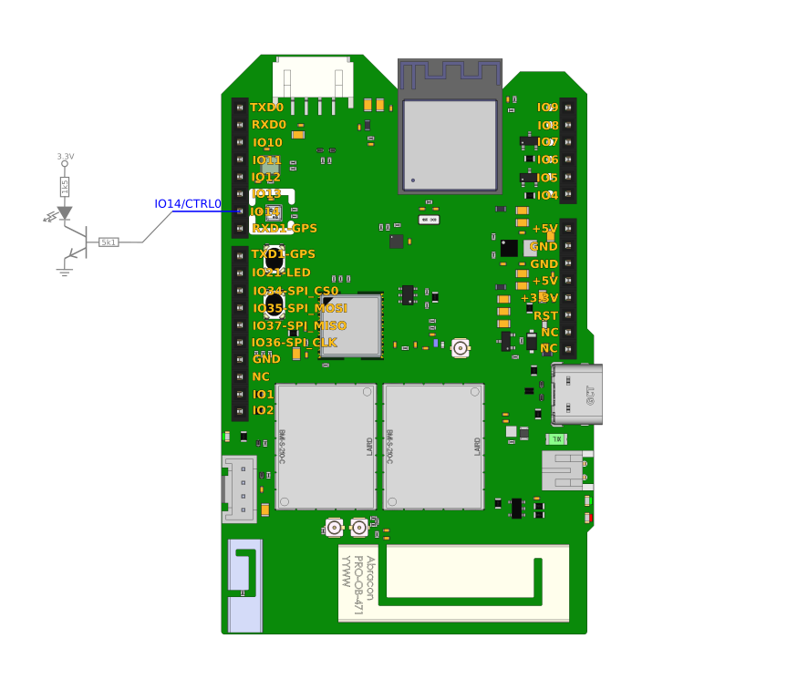
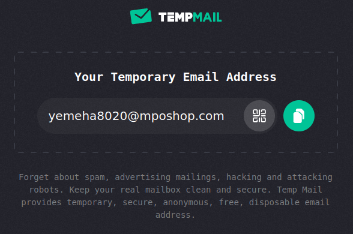

This demonstration showcases the ability to control a physical device using Moonchain. It highlights how a blockchain transaction on Moonchain can remotely turn an LED on or off. Through this process, you will see the seamless integration of blockchain technology with real-world hardware, emphasizing the potential for secure, decentralized control in various applications.

## Moonchain Info

Contract proposals: [https://github.com/MXCzkEVM/MEPs](https://github.com/MXCzkEVM/MEPs)

Deployed Contract addresses:

- MEP801: 0x070B3e2229a27CDd34126E96B2Ce65c63BD1A5CE
- MEP802: 0x28479D68cD3ef5661BDB7505EFD1712D5D0951F6
- MEP803: 0xBFc77Ee5959699eC4171891b625D6EccdC9e00cD

The commands shown in this document use the wallet `0xa2d9E584F4cF0167d283dB6EB4922082269B6bB7` as an example. And you need MXC to pay the gas fee and other fees.

Private key:

    318dee0c207c20f4767e342a52e876b816379334a53277773c783b0e9348d368


## Change the X2E firmware

If your X2E board is running another firmware, please follow the procedures below to change the firmware for this demonstration.

Firmware Repository: [https://github.com/MXCzkEVM/Moonchain-Control-X2E](https://github.com/MXCzkEVM/Moonchain-Control-X2E)

1. Download the mobile APP tool (Nordic DFU) for firmware update.
   - [Google Play Store](https://play.google.com/store/apps/details?id=no.nordicsemi.android.dfu&hl=en&gl=US)
   - [Apple App Store](https://apps.apple.com/tt/app/nrf-device-firmware-update/id1624454660) (require iOS 16)

2. Copy the firmware binary file `demo_controls_dfu_ism2400.zip` to your mobile phone.
   - (Important: Place the file in the download folder, otherwise it may not be recognized correctly)

3. Start the DFU App and select the firmware binary file.
   

4. Tap the Device's "Select" button to start scanning for BLE devices.

5. Press and hold the "USER" button of the X2E board for 5s to start the DFU routine. The LED will become fast blinking when DFU started and it will shows up on the App.
   

6. Select the X2E board on the list as the target device.
   

7. Tap the "Start" button to start the firmware upgrade.
   

8. Wait until the upgrade process completes.

## Connection of X2E

The simplest way to demonstrate the effect is by controlling an LED. Below is an example of the connection.



## Purchase a Provision ID (PID)

Find a temporary email service provider to get the email address for receiving the PID. As the email address will be on the Moonchain, using a temporary email address can prevent your private email address from showing to the public on the chain.



Check the device profile (from MEP803) that we will be using. It needs to match the firmware of the X2E board. We will be using an existing ISM2400 profile, with the index set to 3.


```
cast call 0xBFc77Ee5959699eC4171891b625D6EccdC9e00cD "deviceProfileList(uint256) (uint256,string,address,string,bool,uint256)" 3 --rpc-url https://geneva-rpc.moonchain.com --private-key 318dee0c207c20f4767e342a52e876b816379334a53277773c783b0e9348d368
```

The response will be similar to the following.

```
3
X2E Class C - ISM2400
0xD9892d06C864a41A38915dDd48DF11A0DBfdCf89
https://api.github.com/repos/MatchX-GmbH/iso-device-profile/contents/matchx/x2e_class_c_ism2400.json
true
100000000000000000
```


Check the unit price of a PID from MEP802.

```
cast call 0x28479D68cD3ef5661BDB7505EFD1712D5D0951F6 "pidUnitPrice() (uint256)" --rpc-url https://geneva-rpc.moonchain.com --private-key 318dee0c207c20f4767e342a52e876b816379334a53277773c783b0e9348d368
```

The response will be `123450000000000000000` wei, means 123.45 MXC.


Please replace the email address with your own and send the following command to purchase one PID via MEP802.

```
cast send 0x28479D68cD3ef5661BDB7505EFD1712D5D0951F6 "producePid(string,uint256,uint256)" "yemeha8020@mposhop.com" 1 3 --rpc-url https://geneva-rpc.moonchain.com --private-key 318dee0c207c20f4767e342a52e876b816379334a53277773c783b0e9348d368 --value 123450000000000000000
```

Wait for few minutes after the transaction done, you will receive a email and attached with the PID csv file.


Please read the PID `K2ILSDXUOO3O4EEIWZDDW6SL` from the attached file and use it to set up the X2E board. You will also need the pidZkevmHash (5th column) when interacting with Moonchain.


## Setup the X2E board.

Connect the X2E board to your computer using a USB Type-C cable. Next, launch a serial terminal program like `minicom` on Linux or `PuTTY` on Windows, and establish a connection with the X2E board. Use the serial settings `115200 8N1`.

```
minicom -b 115200 -8  -D /dev/ttyACM0 -o
```

Then send a "AT" command to test the connection. If the connection is correct, the X2E will reply a "OK".


Send the following command at the serial terminal program to change the PID of the X2E board. *Replace the PID to the one got from previous steps.* You will get a OK if success.

```
AT+CQRCODE={"PID":"K2ILSDXUOO3O4EEIWZDDW6SL","B":"MatchX","M":"X2E","V":"1.3"}
```

Clear all data and reboot.

```
AT+IREBOOT=8
```


Wait for a while, the X2E board will finish the provisioning process with the new PID. Then it will start to join the network and sending data. After Joined, the status LED will lit steady and the Control pin (IO14) will goes high. If you are using the suggest connection, the target LED will lit.

If this doesn't happen after 6 minutes, please check the status of your NEO miner and make sure it is running.


After that, your X2E board is connected and able to accept data from the Moonchain.


## Mint the sensor NFT for the X2E board

Check the price for minting a sensor NFT.

```
cast call 0x28479D68cD3ef5661BDB7505EFD1712D5D0951F6 "priceInfoList(uint256) (uint256,uint,bool)" 0 --rpc-url https://geneva-rpc.moonchain.com --private-key 318dee0c207c20f4767e342a52e876b816379334a53277773c783b0e9348d368
```

The response will similar as below. The first line is the price. 9876500000000000000 equal to 9.8765 MXC.

```
9876500000000000000
0
true
```


Mint the NFT by replacing `0xf6d4bd...` with the pidZkevmHash you received earlier.

```
cast send 0x28479D68cD3ef5661BDB7505EFD1712D5D0951F6 "mintSensorNFT(uint256,uint256,string)" 0xf6d4bda9e25797a1423a41c485bfaa8e03930f0dbdf2d2b324d79fa71d8c9108 0 "https://global.matchx.io/iso/x2e/x2e_ref_sensor.jpeg" --rpc-url https://geneva-rpc.moonchain.com --private-key 318dee0c207c20f4767e342a52e876b816379334a53277773c783b0e9348d368 --value 9876500000000000000
```

After Sensor NFT minted, you are ready to send data to the X2E board via Moonchain.


To repeat the minting process, you must first burn the Sensor NFT.

```
cast send 0x28479D68cD3ef5661BDB7505EFD1712D5D0951F6 "burnSensorNFT(uint256)" 0xf6d4bda9e25797a1423a41c485bfaa8e03930f0dbdf2d2b324d79fa71d8c9108 --rpc-url https://geneva-rpc.moonchain.com --private-key 318dee0c207c20f4767e342a52e876b816379334a53277773c783b0e9348d368
```


## Controlling via Moonchain

The controlled pin output has three modes: the first mode sets the output to always low, the second mode sets it to always high, and the third mode toggles the pin, causing the LED to blink.

Please replace `0xf6d4bd...` with the pidZkevmHash you received earlier in the example commands below.

The controlled pin should be changed within 2 minutes after the transaction is completed.


Set controlled to low (Turn off LED):

```
cast send 0x28479D68cD3ef5661BDB7505EFD1712D5D0951F6 "enqueueDownlink(uint256,string,uint8,uint8)" 0xf6d4bda9e25797a1423a41c485bfaa8e03930f0dbdf2d2b324d79fa71d8c9108 "QhMA" 1 0 --rpc-url https://geneva-rpc.moonchain.com --private-key 318dee0c207c20f4767e342a52e876b816379334a53277773c783b0e9348d368
```

Set controlled to high (Turn on LED):

```
cast send 0x28479D68cD3ef5661BDB7505EFD1712D5D0951F6 "enqueueDownlink(uint256,string,uint8,uint8)" 0xf6d4bda9e25797a1423a41c485bfaa8e03930f0dbdf2d2b324d79fa71d8c9108 "QhMB" 1 0 --rpc-url https://geneva-rpc.moonchain.com --private-key 318dee0c207c20f4767e342a52e876b816379334a53277773c783b0e9348d368
```

Set controlled to cycling (Blinking the LED):

```
cast send 0x28479D68cD3ef5661BDB7505EFD1712D5D0951F6 "enqueueDownlink(uint256,string,uint8,uint8)" 0xf6d4bda9e25797a1423a41c485bfaa8e03930f0dbdf2d2b324d79fa71d8c9108 "QhMC" 1 0 --rpc-url https://geneva-rpc.moonchain.com --private-key 318dee0c207c20f4767e342a52e876b816379334a53277773c783b0e9348d368
```


