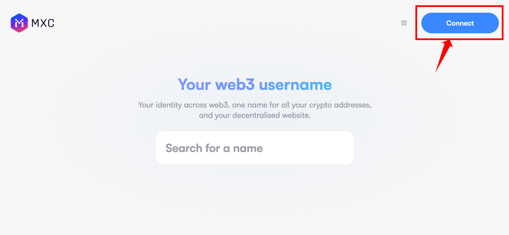
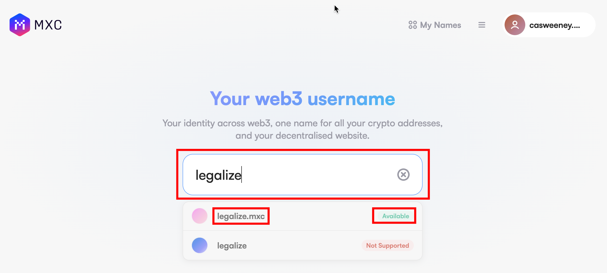
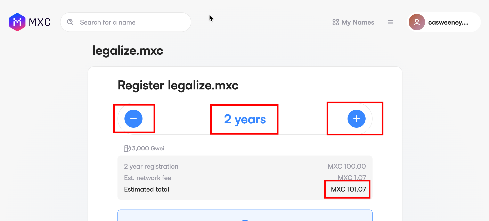
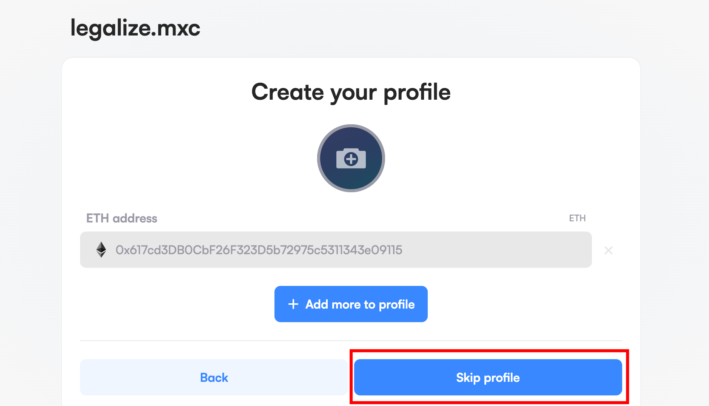
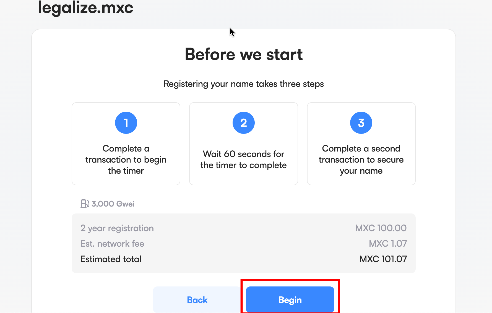
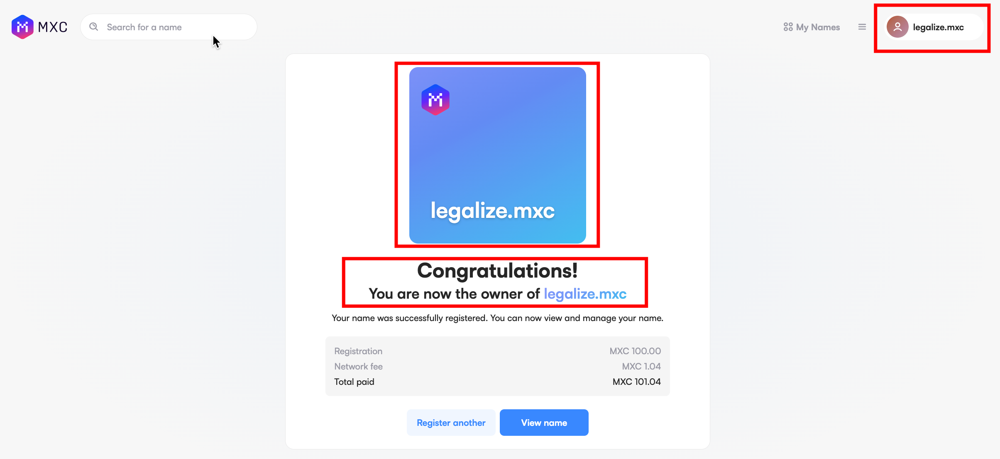

This guide will help you get an MXC domain name and show you how to name a hexagon with the your domain name.

## Prerequisites
- You should have an Ethereum wallet address. Metamask is preferred.
- You should have some MXC tokens to pay for MXC domain name and transaction fee. Get some tokens using [this guide](/docs/Tutorials/receive-tokens).

## Steps

### 1. Navigate to the Wannsee MNS and Connect Your Wallet
- Make sure your wallet is on MXC Wannsee zkEVM Testnet network
- Navigate to the [MXC Wannsee MNS](https://wannsee-mns.mxc.com/)
- Click on the Connect button at the top right corner
- Select Metamask from the modal that pops up and connect your wallet

### 2. Search for a Preferred Available Username
- Type any preferred name in the search box and check for availability
- If available, click on the name with a green Available flag beside it

### 3. Configure Domain Name Purchase
- Click on the plus (+) button in increase the number of years you intend purchasing the Domain Name
- You can turn on the Use as primary name switch, if you want the domain name to be use as your wallet address name
- Click on the Next Button at the bottom of the page

### 4. Click the Skip profile Button
- After click the Next Button in the previous page, it takes you to a Create your profile page
- Click the Skip profile button

### 5. Start the Domain Registration
- Click on the Begin button to start the actual domain registration transaction
- A modal will pop, on that modal click the Open Wallet button
- Metamask will popup, click the Confirm button on the Metamask popup and wait for the transaction to process
- Click the Finish button. Don't close the modal
- Click the Open Wallet button again the second time
- Metamask will popup again, click the Confirm button and wait for the transaction to finish processing
- Once the transaction has finished processing you will see a congratulation page and your wallet address will change to your domain name

You have successfully purchased an MNS Domain Name, Let's now name a Hexagon with it.