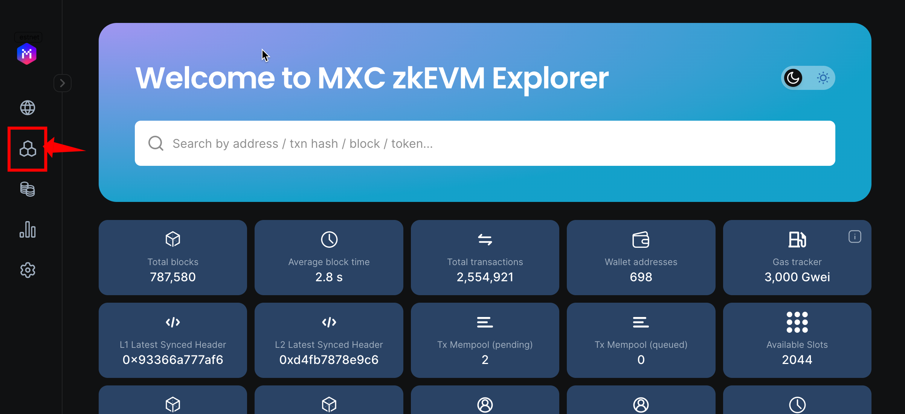
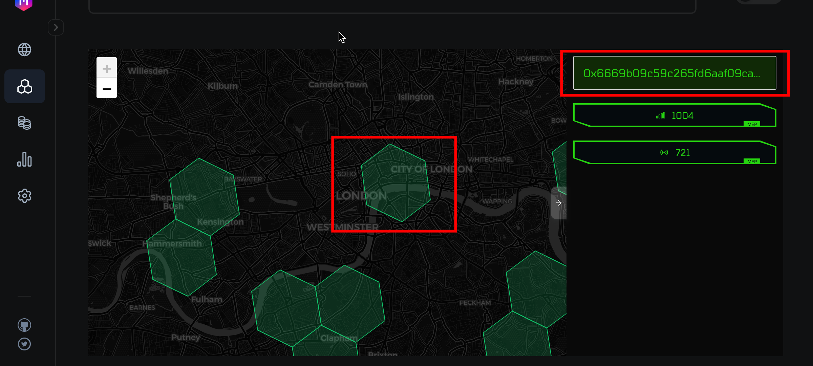
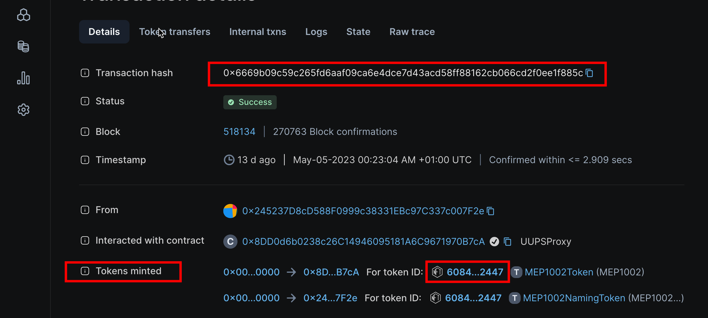
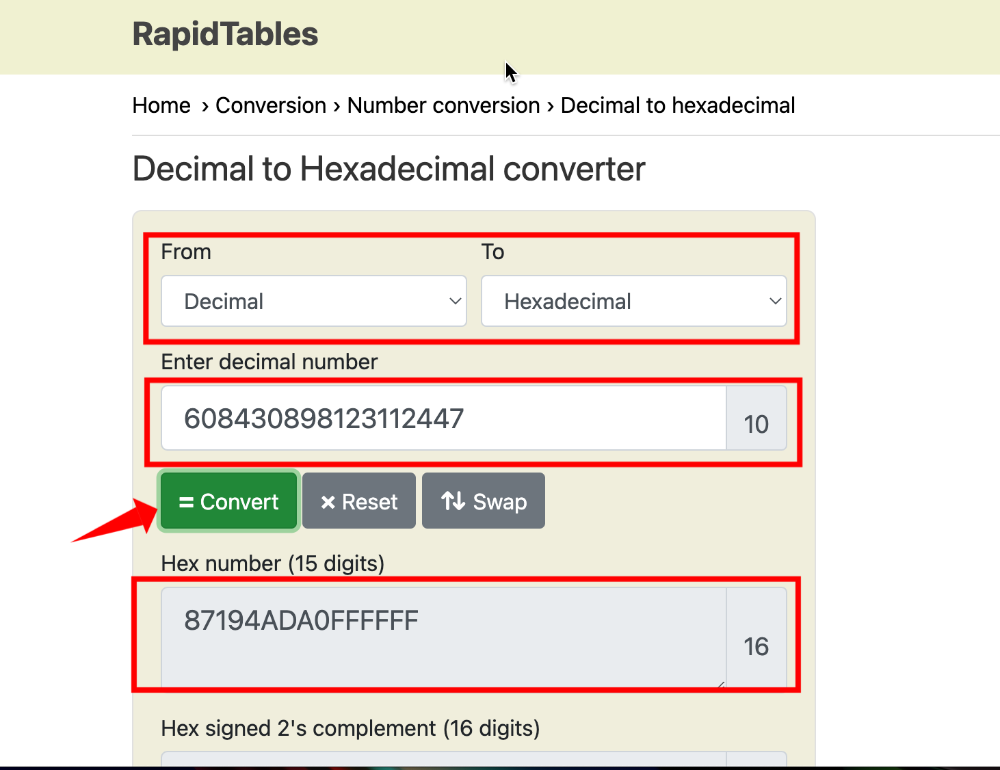
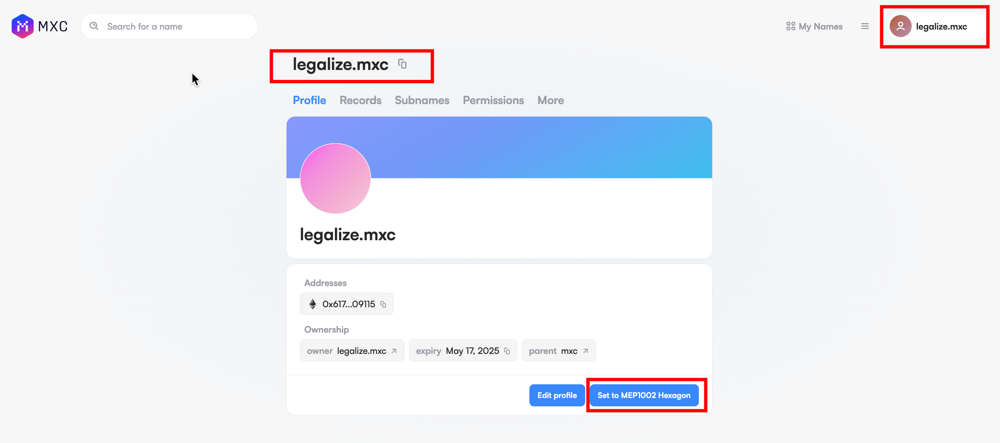
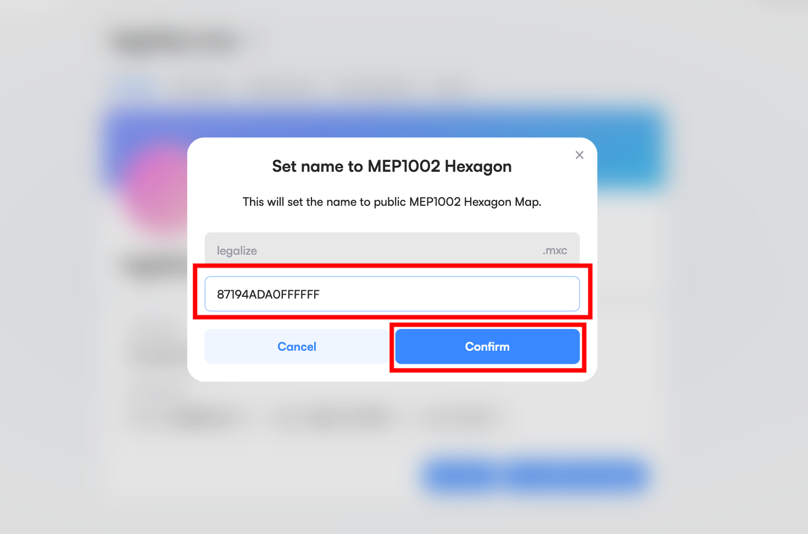
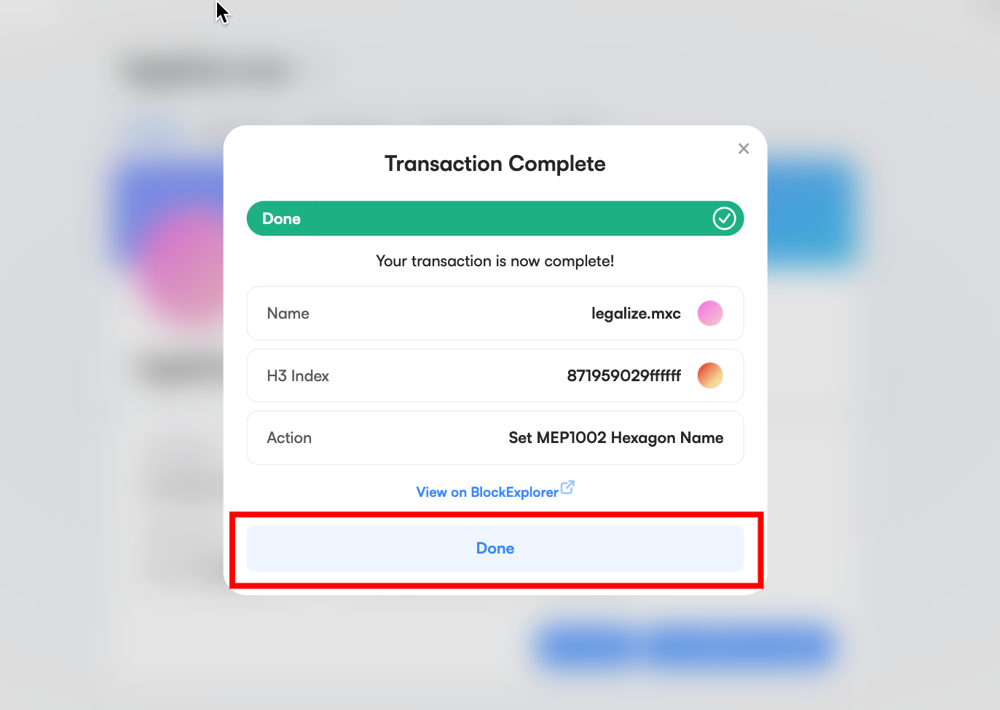
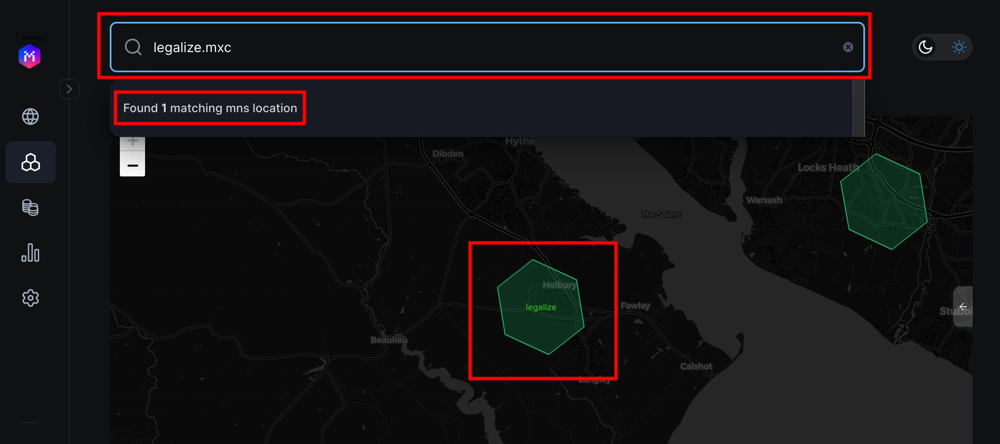

This guide will help you name a Hexagon using any of your Hexagon Domain Name

<iframe width="560" height="315" src="https://www.youtube.com/embed/_YbllGOfEbA" title="YouTube video player" frameborder="0" allow="accelerometer; autoplay; clipboard-write; encrypted-media; gyroscope; picture-in-picture; web-share" allowfullscreen></iframe>

## Prerequisites
- You should already have a Hexagon Domain Name. Get one using [this guide](/docs/Tutorials/get-hexagon-domain).

## Steps

### 1. Navigate to the Wannsee ZK Explorer
- Navigate to the [Wannsee ZK Explorer](https://wannsee-explorer.mxc.com/)
- On the left hand side of the page, you'll see a vertical list of icons
- Click on the second icon titled Mapper

### 2. Get Hexagon Address
- On the Mapper page, click on any of the Hexagon (the green Hexagon shapes), click on any
- Onclick of a Hexagon, you will see modal at the right side of the screen
- Click on Hexagon Address, the first item on the list (the one starting with 0x)

### 3. Get the Transaction Hash
- Onclick of the Hexagon Address in the previous page, it takes you to transaction detail page
- Copy the transaction hash and ask MXC team for Naming Rights, but in near future we will put the Naming Right NFTs in an NFT marketplace for people to purchase.
- Once Naming Rights is given to your address
- On the same transaction detail page where you copied the transaction hash, get/copy the token ID under the Tokens minted section

### 4. Get the HEX of the Token ID
- After copying the token ID, navigate to [RapidTables](https://www.rapidtables.com/convert/number/decimal-to-hex.html)
- Select From Decimal, To Hexadecimal
- Paste the Token ID you copied and click the Convert button
- You will get the Hexadecimal of the Token ID
- Copy the Hexdecimal, you will need it to name the Hexagon

### 5. Navigate Back to Wannsee MNS and Set Hexagon to your Domain Name
- Navigate to the [MXC Wannsee MNS](https://wannsee-mns.mxc.com/)
- Connect your Wallet
- Search for your registered domain name and click on it
- Click on the Set to MEP1002 Hexagon

- A modal will popup, paste in the Hexadecimal gotten from converting the Token ID
- Click the Confirm button
- Click on Open Wallet button
- Metamask will popup, Click Confirm on the Metamask popup and wait for transaction to complete

- Click on Done

### 6. Confirm the Hexagon was set to your Domain Name
- Navigate to the [Wannsee Explorer Mapper](https://wannsee-explorer.mxc.com/mapper)
- In the search box, type your domain name, e.g: legalize.mxc
- You should see: Found 1 matching mns location
- Press enter on your keyboard, and you will see the Hexagon that has your Domain Name

You have successfully set a Hexagon to you Domain Name.