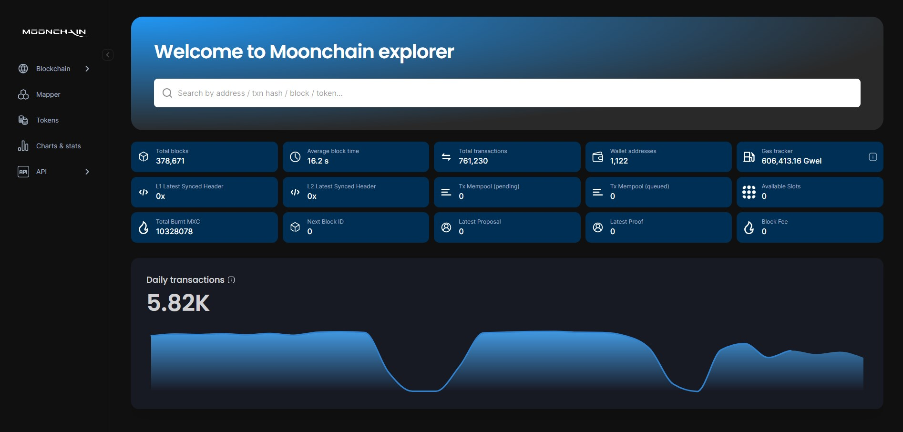
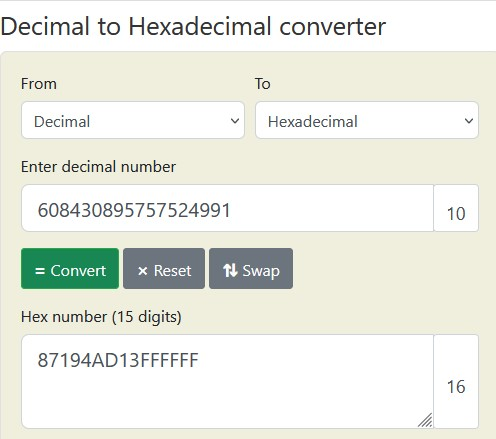
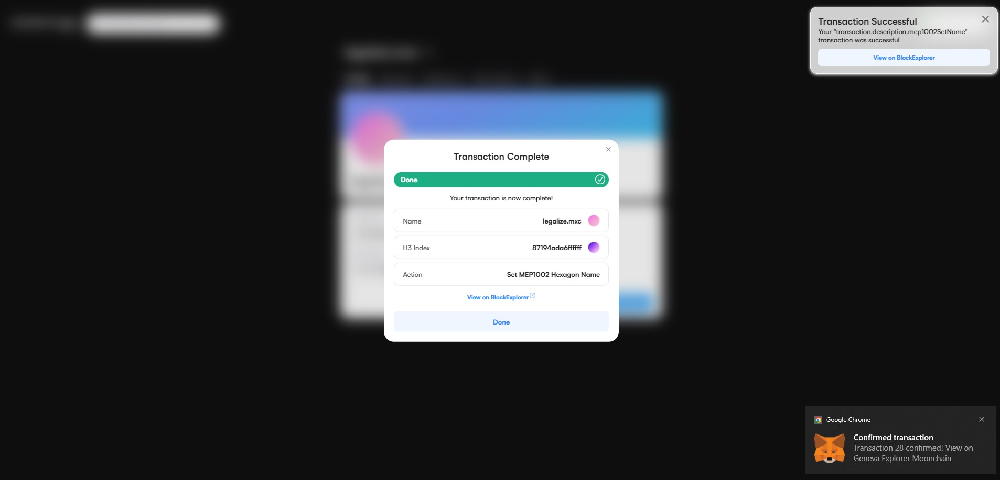

This guide will help you name a Hexagon using any of your Hexagon Domain Name

## Prerequisites
- You should already have a Hexagon Domain Name. Get one using [this guide](/docs/Tutorials/get-hexagon-domain).

## Steps

### 1. Navigate to the Geneva ZK Explorer
- Navigate to the [Geneva ZK Explorer](https://geneva-explorer.moonchain.com/)
- On the left hand side of the page, you'll see a vertical list of icons
- Click on the second icon titled Mapper

### 2. Get Hexagon Address
- On the Mapper page, click on any area without a Hexagon (the green Hexagon shapes)
- Onclick of the map, you will see a hexadecimal number at the right side of the screen. This number is the area identifier.
- Copy this hexadecimal number 

### 3. Mint your Hexagon on MNS
- To mint the selected hexagon, switch to the Moonchain MNS and select your account.
- Under 'Profile', click on the Mint MEP1002 Hexagon button and enter the hexadecimal digit of the previously selected map area in the popup that opens. Click confirm and approve the transaction in your wallet. Keep the popup open until the transaction is completed. 
- When you look into the Mapper on Moonchain Explorer you now can see your newly minted hexagon.

### 4. Set the name of our Hexagon
- After the confirmed mint of your Hexagon, you are able to name it with an MNS name.
- To do this, click on the "Set to MEP1002 Hexagon" button.
- In the pop-up again enter the hexadecimal number of your selected map area. 
- If you need this number again, you can use the address of your minted hexagon to search for it in the [Geneva ZK Explorer](https://geneva-explorer.moonchain.com/)
- the searched hexadecimal number is the minted token id converted from decimal to hexadecimal

- After entering the number click confirm and approve the transaction in your wallet. Keep the popup open until the transaction is completed.

### 6. Confirm the Hexagon was set to your Domain Name
- Navigate to the [Geneva Explorer Mapper](https://Geneva-explorer.mxc.com/mapper)
- In the search box, type your domain name, e.g: legalize.mxc
- You should see: Found 1 matching mns location
- Press enter on your keyboard, and you will see the Hexagon that has your Domain Name

You have successfully set a Hexagon to you Domain Name.
